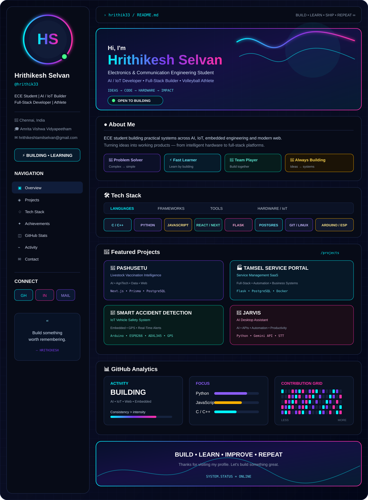

### 🚀 Projects
PASHUSETU · TAMSEL Service Portal · Smart Accident Detection · JARVIS · HELIOS Automazioni

### 🛠 Tech
C · C++ · Python · JavaScript · TypeScript · React · Next.js · Flask · PostgreSQL · Arduino · ESP8266 · Git

### 📊 GitHub Analytics

### 📡 Connect

<a href="https://github.com/hrithik33">GitHub</a> · <a href="mailto:hrithikeshtamilselvan@gmail.com">Email</a>  **Build • Learn • Improve • Repeat.**
