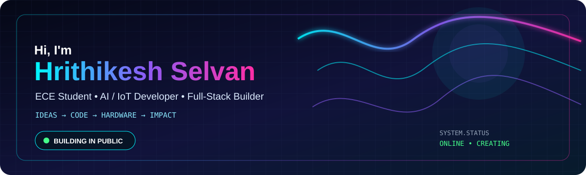

<div align="center">



</div>

<table><tr><td width="27%" valign="top">

# 👨‍💻 Hrithikesh Selvan

**@hrithik33**

🎓 **ECE Student**  
Amrita Vishwa Vidyapeetham, Chennai

🤖 **AI / IoT Builder**  
🌐 **Full-Stack Developer**  
⚡ **Embedded Systems**  
🏐 **Volleyball Athlete**

> *Building solutions where software, hardware and intelligence meet.*

### 📍 Chennai, India

### 🧭 Navigation

- 🏠 **Overview**
- 🚀 [Projects](#-featured-projects)
- 🛠️ [Tech Stack](#-tech-stack)
- 📊 [GitHub Stats](#-github-analytics)
- 🎯 [Mission](#-mission)
- 📡 [Connect](#-connect)

### ⚡ Quick Status

**Currently building**

AI • IoT • SaaS

**Learning**

Systems • AI • Cloud

**Mindset**

Build → Test → Ship

</td><td width="73%" valign="top">

<div align="right">hrithik33 / README.md &nbsp;&nbsp; BUILD • LEARN • SHIP • REPEAT</div>

## 🟣 About Me

I’m an **Electronics & Communication Engineering student** who likes taking ideas beyond prototypes and turning them into usable products.

My work sits across **AI, IoT, embedded systems and full-stack development**. I enjoy building systems that connect the physical world to intelligent software — from accident detection hardware to AI assistants and business platforms.

### 💡 What drives me

<table><tr><td align="center">🧠<br><b>Problem Solver</b><br><sub>Break complex problems down.</sub></td><td align="center">⚡<br><b>Fast Learner</b><br><sub>Learn by building.</sub></td><td align="center">🤝<br><b>Team Player</b><br><sub>Build with people.</sub></td><td align="center">🚀<br><b>Always Building</b><br><sub>Ideas → working systems.</sub></td></tr></table>

## 🛠️ Tech Stack

<table><tr><td><b>Languages</b></td><td></td></tr><tr><td><b>Frameworks</b></td><td></td></tr><tr><td><b>Data & Tools</b></td><td></td></tr><tr><td><b>Hardware / IoT</b></td><td>Arduino • ESP8266 • ADXL345 • GPS NEO-6M • Blynk • MATLAB • LTspice</td></tr></table>

## 🚀 Featured Projects

<table><tr><td width="50%" valign="top">
### 🐄 PASHUSETU
**Livestock Vaccination Intelligence Platform**

Village-level vaccination tracking, prioritization and campaign scheduling.

Next.js • Prisma • PostgreSQL • AI

**Focus:** AgriTech • Intelligence • Data

</td><td width="50%" valign="top">
### 🏭 TAMSEL
**Service Management SaaS**

Role-based service portal for administrators, employees and customers.

Flask • PostgreSQL • Docker

**Focus:** SaaS • Automation • Business Systems
</td></tr>
<tr><td width="50%" valign="top">
### 🚗 SMART ACCIDENT DETECTION
**IoT Vehicle Safety System**

Motion + GPS + connectivity for accident detection and real-time alerts.

Arduino • ADXL345 • ESP8266 • GPS

**Focus:** Embedded • IoT • Safety
</td><td width="50%" valign="top">
### 🤖 JARVIS
**AI Desktop Assistant**

Personal AI assistant combining conversational intelligence with desktop automation.

Python • Gemini API • STT • Automation

**Focus:** AI • APIs • Productivity
</td></tr></table>

### ⚙️ HELIOS AUTOMAZIONI

Cinematic industrial automation web experience with interactive machine showcases.

Next.js • Tailwind CSS • Framer Motion

---

## 📊 GitHub Analytics

<div align="center"> </div>

<div align="center"></div>

## 📡 Engineering Activity

```text
┌───────────────────────────────────────────────────────────────┐
│  CURRENT MODE                                                │
│                                                               │
│  [✓] Learn new technology                                    │
│  [✓] Build real-world systems                                │
│  [✓] Connect hardware + software                             │
│  [✓] Experiment with AI                                      │
│  [✓] Improve every iteration                                 │
│                                                               │
│  STATUS: ONLINE • BUILDING • SHIPPING                        │
└───────────────────────────────────────────────────────────────┘
```

## 🎯 Mission

- 🚀 Build production-ready **AI + IoT** products
- 🧠 Go deeper into **AI, systems and embedded engineering**
- 🌐 Ship polished **full-stack applications**
- 🧩 Contribute to meaningful **open source**
- 🏐 Keep improving as an **engineer and athlete**

## 📡 Connect

<div align="center"><a href="https://github.com/hrithik33"></a> <a href="mailto:hrithikeshtamilselvan@gmail.com"></a><br><br><b>“Build • Learn • Improve • Repeat.”</b><br></div>

</td></tr></table>

<div align="center"></div>